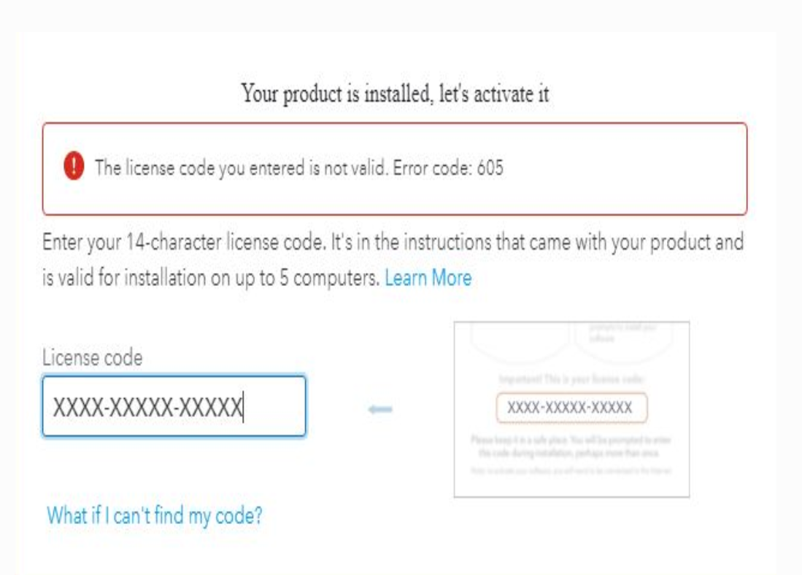

|

#############
Installturbotax.com
#############

TurboTax is a unique tax preparation software that helps you file your state and federal tax returns in a very systematic manner and also has several features through which you can maximize your tax refunds. There are different ways you can download and `Installturbotax.com <https://installturbotaxcom.readthedocs.io>`_ software on your computer.

|
*************
Easy Steps on How To Install TurboTax On Mac
*************

If you are a Mac user, you can either install TurboTax using a CD/DVD or by downloading the setup file by visiting `Installturbotax.com <https://installturbotaxcom.readthedocs.io>`_. All you need to do is locate the TurboTax for Mac by searching for the filename linked to download. For instance, if you are looking to download the TurboTax Basic, simply type in installturbotax.com. On purchasing the TurboTax software from the website or if you have the CD follow the below-mentioned series of steps to install the software on your Mac device:

1. Insert the TurboTax CD/DVD into the optical drive of your Mac.
2. In case you have downloaded the TurboTax software, double-click the ‘.dmg’ file.
3. Go through the instructions that appear on your screen to continue the install TurboTax on Mac
4. You need to drag the red TurboTax icon to the Applications folder.
5. Refrain from dragging the TurboTax icon beyond the pop-up window of the existing Applications folder.

*************
How to Download TurboTax on Windows 10
*************

Before you start installing TurboTax on your computer, you need to either purchase the installation CD or download the software from the official site of `Installturbotax.com <https://installturbotaxcom.readthedocs.io>`_. To download TurboTax for Windows 10 OS, follow the steps mentioned under:

* Sign in to your TurboTax account using appropriate login credentials.
* Locate the blue “Download” link to download the software.
* Save the downloaded file somewhere on your computer.
* Lastly, open the TurboTax download file to install it on your computer.

*************
TurboTax Registration Key Features
*************

* Walks you through your administration structure, twofold checks as you go.
* Save time by getting cash-related data including W-2s.
* Extensively more overhauls, moreover bug fixes.
* Preparing charge credits.
* No obligation data required.
* Tweaked to your fascinating condition.
* Live ace answers by phone.
* An enormous number of slip-up checks.
* Completely educated with respect to the latest obligation laws.
* Your information is secure.
* See your obligation rebate logically.
* Free government e-record for your fastest possible obligation rebate.
* Your cost rebate, your heading.
* No money utilizing money close by.
* Finish your state return faster.
* Go at your own movement—no plan significant.
* Customized import of your W-2 moreover 1099 data.
* Get a head start also.
